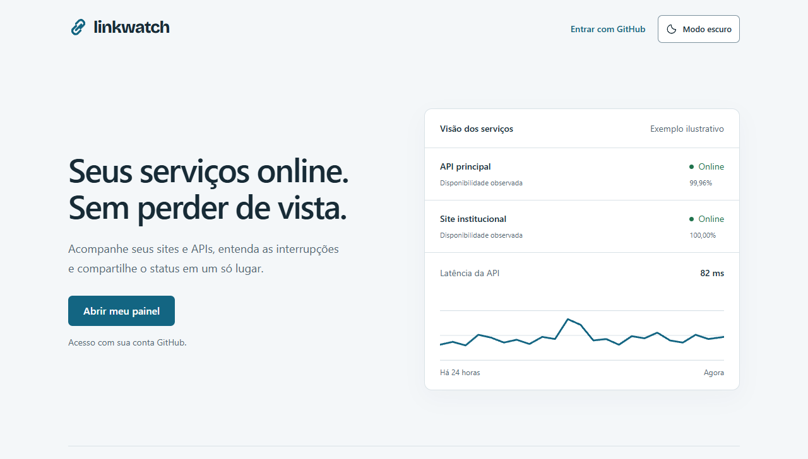
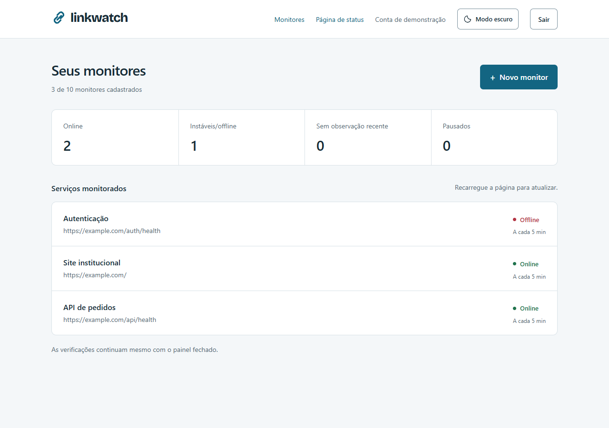

# LinkWatch

Monitor de disponibilidade para sites e APIs HTTP. Cadastre um endpoint, acompanhe latência e falhas, investigue incidentes e compartilhe uma página pública de status.

**[Guia de avaliação](docs/AVALIACAO.md) · [Executar localmente](#executar-localmente) · [Arquitetura](docs/ARCHITECTURE.md) · [CI](https://github.com/samuelsce/LinkWatch/actions)**



Projeto de portfólio full stack de [@samuelsce](https://github.com/samuelsce), com foco em processos em segundo plano, concorrência, isolamento de dados e segurança de requisições externas. A aplicação web, o worker e a página pública estão implementados. A avaliação disponível é local; deploy, validação do OAuth real e testes de capacidade seguem pendentes.

A captura acima vem do build local. Os números da apresentação estão identificados na interface como **exemplo ilustrativo** e não representam disponibilidade medida em produção.

## Conheça o projeto em dois minutos

1. Abra a apresentação local e experimente os temas claro e escuro, inclusive em uma tela estreita.
2. Com PostgreSQL, OAuth e worker configurados, entre pelo GitHub e cadastre um endpoint público que responda sem redirecionamento.
3. Abra o monitor para consultar as verificações, disponibilidade observada, latência média, p95 e incidentes.
4. Pause e retome a coleta. O painel distingue serviços pausados, indisponíveis e sem observações recentes.
5. Em **Página de status**, selecione os serviços, revise seus nomes públicos e publique. Abra o endereço em uma janela sem sessão para conferir o que um visitante recebe.

Para uma avaliação pelo código, o [guia de avaliação técnica](docs/AVALIACAO.md) relaciona cada decisão aos arquivos e testes que a demonstram. Para uma prévia visual, basta iniciar a web; o fluxo completo exige banco, OAuth e worker.

## Funcionalidades

- Login GitHub, sessões no PostgreSQL, rotas privadas e logout que invalida a sessão.
- Cadastro, edição, pausa, retomada e exclusão de monitores, com validação no servidor e limite por conta.
- Coleta em processo independente, até cinco requisições simultâneas por worker e recuperação de reservas expiradas.
- Verificações GET com validação de URL, DNS e IP, TLS verificado e tempo limite total.
- Incidentes confirmados após duas falhas consecutivas e resolvidos após um sucesso.
- Histórico de 24 horas, 7 dias e 30 dias; gráficos com lacunas, falhas e tabela alternativa.
- Página pública opcional, com seleção de serviços e sem exposição de URLs monitoradas ou identidade do dono.
- Temas claro e escuro, preferência persistida, teclado, foco visível e respeito a movimento reduzido.
- Retenção de verificações, heartbeat do worker, endpoints de saúde e CI com testes de banco e navegador.

## Decisões que vale inspecionar

| Problema | Solução implementada | Onde ler |
| --- | --- | --- |
| Continuar coletando sem visitas ao painel | Worker Node independente da aplicação web | [runtime.ts](src/worker/runtime.ts), [ADR do worker](docs/adr/0001-separate-monitoring-worker.md) |
| Dois workers tentarem concluir o mesmo ciclo | Reservas com vencimento, token e revisão de configuração, conferidos na transação de conclusão | [scheduler.ts](src/monitoring/scheduler.ts), [testes concorrentes](tests/integration/scheduler.test.ts) |
| Uma URL alcançar a rede interna por DNS ou redirecionamento | Rejeitar destinos proibidos, fixar o IP validado e não seguir redirecionamentos | [probe.ts](src/monitoring/probe.ts), [testes HTTP/TLS](tests/integration/probe-http.test.ts) |
| Alterar dados de outra conta ou perder uma edição concorrente | Dono derivado da sessão, locks e comparação de `updatedAt` | [service.ts](src/features/monitors/service.ts), [jornadas de isolamento](tests/e2e/monitors.spec.ts) |
| Confundir erro do coletor com falha do endpoint | Resultados operacionais separados e regras puras de transição | [check-transition.ts](src/domain/check-transition.ts), [history.ts](src/features/monitors/history.ts) |
| Publicar status sem vazar dados privados | Seleção explícita e projeção restrita de campos públicos | [public.ts](src/features/status-pages/public.ts), [testes de publicação](tests/integration/status-pages.test.ts) |

## Interface



O painel reúne os serviços em uma lista contínua, com estado e frequência de coleta. O detalhe permite investigar o histórico e a recuperação de incidentes. Veja o [histórico no tema escuro](docs/screenshots/history-dark-desktop.png) e a [página pública no celular](docs/screenshots/status-mobile.png).

As capturas do painel, histórico e status usam **registros fictícios em um banco de testes isolado**. Mostram a interface implementada, sem representar uma demo hospedada, um login OAuth real ou resultados de carga. A [origem das capturas](docs/screenshots/README.md) está documentada.

## Tecnologias

Next.js 16, React 19, TypeScript, Node.js 24, PostgreSQL, Prisma 7 e Auth.js v5 beta com GitHub OAuth. Tailwind CSS 4 e SVG compõem a interface; Bricolage Grotesque é servida localmente apenas na marca. Vitest cobre regras e integração; Playwright valida as jornadas no navegador.

As versões reproduzíveis estão em [package.json](package.json) e [package-lock.json](package-lock.json). A aplicação web e o worker compartilham regras e banco no mesmo repositório.

## Executar localmente

Requisitos: Git, Node.js **24** e npm. PostgreSQL e uma GitHub OAuth App são necessários para o fluxo autenticado; Docker Compose é uma opção para o banco.

```sh
git clone https://github.com/samuelsce/LinkWatch.git
cd LinkWatch
npm ci
node scripts/setup-local-env.mjs
npm run dev
```

Abra [localhost:3000](http://localhost:3000) para conferir a apresentação e os temas. O script prepara `.env` e gera um segredo de sessão sem imprimi-lo. Preserve esse arquivo fora do Git.

Para o produto completo, configure `DATABASE_URL` e a OAuth App seguindo o [guia de desenvolvimento](docs/DESENVOLVIMENTO.md) e o [guia do OAuth](docs/OAUTH_SETUP.md), aplique as migrations e inicie o worker em outro terminal:

```sh
npm run db:deploy
npm run worker:dev
```

O guia detalha PostgreSQL com ou sem Docker, variáveis, execução do build e diagnóstico. A interface atualiza as observações ao recarregar a página.

## Qualidade e testes

```sh
npm run db:validate
npm run lint
npm run typecheck
npm test
npm run build
```

A validação da identidade visual aprovou **102 testes unitários, 44 de integração PostgreSQL/rede e 18 jornadas de navegador**, além do smoke de web e worker. [Execução correspondente no CI](https://github.com/samuelsce/LinkWatch/actions/runs/37405090355).

Integração, E2E e smoke exigem um banco descartável definido explicitamente por `TEST_DATABASE_URL`. O [guia de desenvolvimento](docs/DESENVOLVIMENTO.md#testes-com-banco-descartável) fornece os comandos; a [estratégia de testes](docs/TESTING.md) explica as evidências e seus limites. O CI usa Chromium e PostgreSQL 17; isso não certifica todos os navegadores, dispositivos físicos ou capacidade em produção.

## Dados, segurança e limites

- Disponibilidade observada é a proporção de verificações bem-sucedidas. Não é SLA nem medição contínua do tempo online. Zero amostras resulta em ausência de dados.
- Latência mede o tempo até os headers; média e p95 usam somente sucessos. O corpo da resposta não é armazenado.
- GET em HTTP/HTTPS, portas 80/443, intervalos de 1/5/15 minutos e timeout de 2 a 15 segundos. Sem seguir redirecionamentos ou enviar cookies, credenciais e headers personalizados.
- Até dez monitores por conta por padrão. Não há rate limiting nem limite global de capacidade implementados; a meta de 100 monitores ainda precisa de teste de carga.
- Verificações concluídas são retidas por 30 dias. Incidentes permanecem enquanto o monitor existir. O detalhe mostra até 50 verificações e 20 incidentes recentes.
- Publicação é opcional. Despublicar ou trocar o slug invalida o endereço anterior nas requisições seguintes; conteúdo já recebido por um visitante não pode ser retirado do navegador.
- Alertas por Discord/e-mail, equipes, cobrança e múltiplas regiões seguem fora da versão atual.

A [revisão de segurança](docs/SECURITY.md) descreve isolamento, SSRF, conteúdo armazenado, cabeçalhos e dependências. Também lista o que falta validar na hospedagem: HTTPS, proxy confiável, limites de abuso, backups e OAuth completo. O worker exige execução contínua; seu empacotamento de produção ainda faz parte do deploy.

## Documentação

| Documento | Para quem é útil |
| --- | --- |
| [Guia de avaliação](docs/AVALIACAO.md) | Quem quer experimentar o produto e localizar evidências no código |
| [Arquitetura e decisões](docs/ARCHITECTURE.md) | Quem quer entender coleta, concorrência, métricas e publicação |
| [Desenvolvimento](docs/DESENVOLVIMENTO.md) | Quem quer executar, verificar e diagnosticar o ambiente |
| [Produto](docs/PRODUCT.md) e [banco](docs/DATABASE.md) | Quem quer consultar regras, relações e invariantes |
| [Segurança](docs/SECURITY.md) e [testes](docs/TESTING.md) | Quem quer avaliar proteções e validações realizadas |
| [Contribuição](CONTRIBUTING.md) | Quem quer reportar um problema ou propor uma mudança |
| [Índice e histórico](docs/README.md) | Quem quer acompanhar a evolução e os guias de aprendizado |
| [Créditos](docs/CREDITOS.md) | Quem quer consultar a origem dos assets e as licenças |

## Autor e processo

Projeto de [@samuelsce](https://github.com/samuelsce), desenvolvido de forma incremental, com apoio de um assistente de IA no planejamento e na implementação. Os commits separam mudanças por responsabilidade; a documentação registra decisões, verificações e guias para compreender e evoluir o código.

Próximos passos: configurar e validar o OAuth real, testar capacidade e limites de abuso, escolher a hospedagem, verificar backups e publicar uma demonstração. A licença geral do projeto ainda não foi escolhida; a licença da fonte incluída está preservada no repositório.
