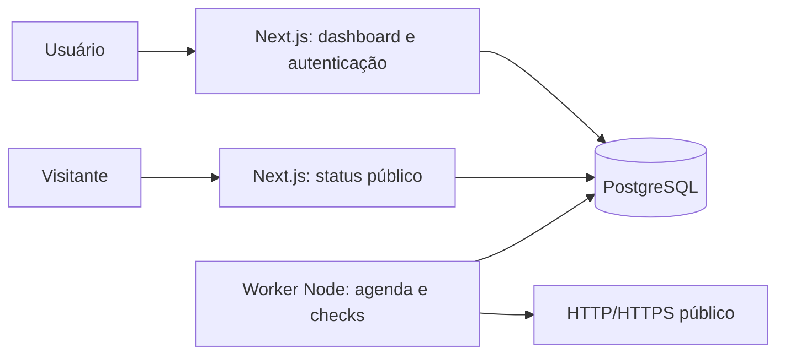

# Arquitetura do LinkWatch

Web, worker, histórico, gráficos, incidentes, retenção e publicação estão implementados. Este documento descreve a arquitetura atual e distingue as decisões de hospedagem ainda pendentes. Para localizar evidências no código, consulte o [guia de avaliação](AVALIACAO.md).

## Estrutura

Um repositório TypeScript reúne a aplicação Next.js e um entrypoint Node para o worker. Os processos compartilham regras de domínio e acesso ao PostgreSQL. O loop de monitoramento não depende de uma requisição web nem importa componentes de interface. Não há API Express, Redis ou broker de mensagens nesta versão.



Alertas por Discord/e-mail e uma outbox transacional permanecem no [backlog](BACKLOG.md), fora do fluxo implementado acima.

Estrutura atual:

```text
src/
  app/                  rotas, páginas e handlers Next.js
  components/           componentes de interface
  features/             serviços de monitores, histórico e páginas de status
  db/                   configuração do cliente PostgreSQL/Prisma
  server/               autenticação e acesso privado ao banco
  domain/               regras puras e tipos compartilhados
  monitoring/           probe, scheduler, conclusão e retenção
  worker/               runtime, loop, entrypoint e heartbeat
  config/               configuração do tema
  assets/               fonte local da marca e licença
prisma/                 schema e migrações versionadas
tests/                  integração, fixtures HTTP e E2E
docs/                   decisões e especificações
```

## Fluxo de monitoramento

Uma reserva, ou lease, concede a um worker um prazo para concluir um ciclo. O token identifica a reserva vigente; a revisão identifica a configuração usada na coleta. Conferir ambos na conclusão impede que um processo atrasado sobrescreva uma configuração mais recente.

1. A criação do monitor grava nextCheckAt = agora e revisão 1.
2. A cada cinco segundos, o worker reserva apenas tantos monitores vencidos quanto seus slots livres, usando transação PostgreSQL e `FOR UPDATE SKIP LOCKED`.
3. A reserva cria um CheckRun com scheduledAt, revision, token de lease e vencimento. A combinação monitorId/scheduledAt é única. A lease dura o timeout configurado mais 30 segundos de margem.
4. O probe resolve DNS, valida todos os endereços e fixa o IP permitido no cliente HTTP. O hostname é preservado para Host/SNI e validação do certificado.
5. Executa GET limitado pelo timeout, sem seguir redirects, e descarta o corpo após headers. O resultado é classificado sem salvar conteúdo da resposta.
6. A transação de conclusão exige token de lease, validade, configuração vigente e monitor ativo. Persiste o resultado e atualiza estado e incidente. Um worker atrasado não pode publicar após perder a reserva.
7. A próxima coleta é agendada a partir da conclusão + intervalo, sem verificações retroativas fictícias. O histórico informa lacunas e coletas iniciadas com mais de 30 segundos de atraso.

Lease expirada: outro worker pode reservar novamente o mesmo CheckRun com um novo token. A chamada HTTP pode se repetir após um crash; a transação aceita uma única conclusão para o ciclo. Isso não garante exatamente uma chamada externa.

Pausa ou alteração de URL invalida a lease e incrementa a revisão sob lock do monitor. Todos os caminhos de finalização, pausa e edição usam a mesma ordem de locks (monitor, CheckRun) para reduzir deadlocks. Excluir o monitor faz cascade dos dados e impede uma finalização tardia.

Erro interno do coletor grava resultado operacional, sem contaminar disponibilidade do endpoint. A próxima observação mantém o intervalo configurado; o loop do scheduler espera cinco segundos entre passagens. A UI mostra perda de coleta quando o limiar de frescor é ultrapassado.

## Autenticação e isolamento

Auth.js v5 beta fixado, GitHub OAuth, adapter Prisma e sessões de banco. O adapter foi testado com o schema atual. Layout, páginas e actions exigem sessão; serviços verificam ownerId derivado dela. Criar usa lock do proprietário para impor limites; editar/pausar/excluir usam lock do monitor e updatedAt para detectar conflito. Cache da sessão é limitado à requisição. Consultas de usuário não são cacheadas globalmente. O retorno OAuth real continua pendente de configuração e validação manual.

Status público usa consulta/projeção própria com allowlist de campos, sem serializar modelos completos. readPublicPage usa snapshot RepeatableRead para consultar publicação, seleção e amostras de forma consistente; retorna somente textos públicos, estados, disponibilidade/amostras, horários e incidentes sem códigos técnicos. Rotas são dinâmicas, sem cache global de publicação. Despublicação/renomeação levam a 404 nas requisições seguintes. Dados já recebidos por um visitante não podem ser retirados do navegador.

Salvar publicação exige sessão, lock do proprietário, locks dos monitores próprios em ordem de ID e versão updatedAt. A seleção é substituída na mesma transação; associações estrangeiras são rejeitadas pela aplicação e FKs. As Server Actions mantêm o Origin/Host check do Next.js. Slug é único no banco; disputa retorna mensagem útil, sem revelar o proprietário atual.

## Requisições externas

URLs controladas pelo usuário criam um risco real de SSRF. Não basta validar a string no formulário: o worker precisa validar a resolução e usar o mesmo endereço validado na conexão. Bloquear IPv4/IPv6 privados, loopback, link-local, reservados, IPv4 mapeado em IPv6 e destinos de metadados. Testar formatos alternativos e respostas DNS mistas.

Camada de rede do deploy deve também restringir egress para destinos internos. Nunca remover essa proteção em produção para facilitar demonstrações. Fixtures locais só podem ser habilitadas em um ambiente de testes isolado.

Referência: [OWASP SSRF Prevention Cheat Sheet](https://cheatsheetseries.owasp.org/cheatsheets/Server_Side_Request_Forgery_Prevention_Cheat_Sheet.html).

## Retenção e capacidade

Limpeza diária em até dez lotes de mil checks concluídos há mais de 30 dias; preservar execuções ativas. Uma lease global evita duplicação. Se todos os lotes ficam cheios, retomar em uma hora; após crash, a lease expira em cinco minutos. Incidentes não são removidos pela retenção. Começar sem particionamento e medir consulta, armazenamento e limpeza.

100 monitores a cada minuto geram aproximadamente 4,32 milhões de checks em 30 dias. Isso é um teto de projeto para validação, não uma promessa de operação gratuita. Começar a demo com poucos monitores e intervalo padrão de cinco minutos.

Métricas são calculadas no servidor com filtros UTC, contagem de resultados de endpoint, média e percentile_disc(0.95) para nearest-rank. Lacunas usam observações da revisão atual; atrasos de início maiores que 30 s e resultados operacionais são informados separadamente. Gráficos agregam buckets (5 minutos em 24 h, 1 hora em 7 d, 6 horas em 30 d), informando média, amostras e falhas. Buckets vazios são preenchidos com contagens zero e média null; isso interrompe a linha. P95 do período continua calculado das amostras originais, não de percentis/médias de buckets.

## Operação e deploy

Desenvolvimento: web + worker + PostgreSQL; Docker Compose é uma opção para o banco, assim como um PostgreSQL acessível por DATABASE_URL. Os comandos e requisitos estão em [DESENVOLVIMENTO.md](DESENVOLVIMENTO.md), sem depender das ferramentas instaladas na máquina do autor.

Produção proposta: web, worker sempre ativo e PostgreSQL, todos na mesma região. Pode ser um host de containers/VPS ou web serverless com worker separado. Selecionar provedor após verificar custos, suspensão por inatividade, backups e egress.

A hospedagem precisa permitir a frequência de coleta de 1/5/15 minutos e a execução contínua do worker. A decisão de separá-lo da web está na [ADR 0001](adr/0001-separate-monitoring-worker.md); não foi escolhido um provedor nesta versão.

- Migrações executadas uma vez por release antes de iniciar serviços compatíveis.
- Liveness do processo e readiness da conexão ao banco separados.
- Heartbeat do worker registra última passagem do scheduler; não conta como check de endpoint.
- Shutdown interrompe novas reservas e dá prazo aos checks ativos; reservas restantes expiram.
- Medir atraso de agenda, checks por resultado, leases expiradas e idade do heartbeat.
- Logs estruturados com monitorId/runId e erro sanitizado; segredos ficam fora do repositório.
- Publicar somente após testar restore de backup, smoke test e ausência de vazamentos na página pública.

## Tradeoffs e próximos passos

- PostgreSQL coordena reservas e persistência, reduzindo o número de serviços. A disputa por locks, o custo das consultas e a retenção precisam ser medidos sob carga.
- O dashboard atualiza ao recarregar. Não há assinatura de eventos, streaming ou polling automático.
- O worker usa TypeScript via `tsx` e exige ferramentas de desenvolvimento no pacote atual. O empacotamento de produção ainda precisa ser definido.
- Limite por conta e cinco slots por processo não substituem rate limiting ou um teto global de capacidade.
- A meta de 100 monitores, backups/restore e OAuth real não foram comprovados pelos testes locais.

Versões exatas e comandos estão em [package.json](../package.json). As restrições de domínio estão no [modelo de dados](DATABASE.md); as verificações e pendências de implantação, em [TESTING.md](TESTING.md) e [SECURITY.md](SECURITY.md).
