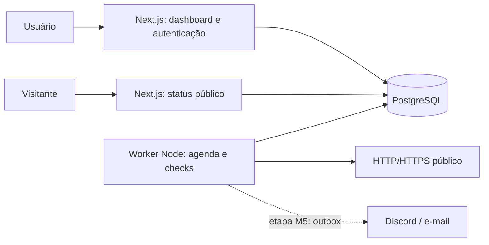

# Arquitetura proposta

Estado: M0–M3 implementados. Worker, histórico, gráficos, incidentes, retenção e publicação estão disponíveis. OAuth real depende de configuração e smoke manual. Deploy, restore e teste de carga ainda são planejamento.

## Estrutura

Um repositório TypeScript, com aplicação Next.js e um entrypoint Node para o worker. Compartilhar regras de domínio e acesso ao banco; não executar o loop de monitoramento dentro de uma requisição ou importar código de UI no worker. Não adicionar uma API Express ou Redis antes de uma necessidade concreta.



Estrutura alvo:

```text
src/
  app/                  rotas, páginas e handlers Next.js
  components/           componentes de interface
  features/             monitores, métricas, incidentes e status
  server/               autenticação e acesso privado ao banco
  domain/               regras puras e tipos compartilhados
  monitoring/           URL safety, probe e persistência de resultados
  worker/               scheduler, entrypoint e health
prisma/                 schema e migrações versionadas
tests/                  integração, fixtures HTTP e E2E
docs/                   decisões e especificações
```

## Fluxo de monitoramento

1. A criação do monitor grava nextCheckAt = agora e revisão 1.
2. A cada cinco segundos, o worker reserva apenas tantos monitores vencidos quanto seus slots livres. Usar transação PostgreSQL e `FOR UPDATE SKIP LOCKED`.
3. A reserva cria um CheckRun com scheduledAt, revision, token de lease e vencimento. A combinação monitorId/scheduledAt é única. A lease deve exceder o timeout + margem de persistência.
4. Resolver DNS, validar todos os endereços e fixar o IP permitido no cliente HTTP. Preservar hostname para Host/SNI e validação do certificado.
5. Realizar GET limitado pelo timeout. Não seguir redirects; cancelar/descartar corpo após headers. Classificar resultado sem salvar conteúdo da resposta.
6. Na transação de conclusão, exigir token de lease, validade, configuração vigente e monitor ativo. Persistir o resultado, atualizar estado e incidente. Um worker atrasado não pode publicar após perder a reserva.
7. Agendar o próximo check a partir da conclusão + intervalo. Não criar backlog retroativo. Publicar atraso/lacunas de agenda como métricas do coletor.

Lease expirada: outro worker pode reservar novamente o mesmo CheckRun com um novo token. A chamada HTTP pode se repetir após um crash; a persistência deve ser única. Não prometer exatamente uma chamada externa.

Pausa ou alteração de URL invalida a lease e incrementa a revisão sob lock do monitor. Todos os caminhos de finalização, pausa e edição usam a mesma ordem de locks (monitor, CheckRun) para reduzir deadlocks. Excluir o monitor faz cascade dos dados e impede uma finalização tardia.

Erro interno do coletor grava resultado operacional, sem contaminar disponibilidade do endpoint. Backoff limitado evita loop de erros; a UI mostra perda de coleta quando o limiar de frescor é ultrapassado.

## Autenticação e isolamento

Implementação M1: Auth.js v5 beta fixado, GitHub OAuth, adapter Prisma e sessões de banco. O adapter foi testado com o schema atual. Layout, páginas e actions exigem sessão; serviços verificam ownerId derivado dela. Criar usa lock do proprietário para impor limites; editar/pausar/excluir usam lock do monitor e updatedAt para detectar conflito. Cache da sessão é limitado à requisição. Consultas de usuário não são cacheadas globalmente.

Status público usa consulta/projeção própria com allowlist de campos, sem serializar modelos completos. readPublicPage usa snapshot RepeatableRead para consultar publicação, seleção e amostras de forma consistente; retorna somente textos públicos, estados, disponibilidade/amostras, horários e incidentes sem códigos técnicos. Rotas são dinâmicas, sem cache global de publicação. Despublicação/renomeação levam a 404 nas requisições seguintes. Dados já recebidos por um visitante não podem ser retirados do navegador.

Salvar publicação exige sessão, lock do proprietário, locks dos monitores próprios em ordem de ID e versão updatedAt. A seleção é substituída na mesma transação; associações estrangeiras são rejeitadas pela aplicação e FKs. As Server Actions mantêm o Origin/Host check do Next.js. Slug é único no banco; disputa retorna mensagem útil, sem revelar o proprietário atual.

## Requisições externas

URLs controladas pelo usuário criam um risco real de SSRF. Não basta validar a string no formulário: o worker precisa validar a resolução e usar o mesmo endereço validado na conexão. Bloquear IPv4/IPv6 privados, loopback, link-local, reservados, IPv4 mapeado em IPv6 e destinos de metadados. Testar formatos alternativos e respostas DNS mistas.

Camada de rede do deploy deve também restringir egress para destinos internos. Nunca remover essa proteção em produção para facilitar demonstrações. Fixtures locais só podem ser habilitadas em um ambiente de testes isolado.

Referência: [OWASP SSRF Prevention Cheat Sheet](https://cheatsheetseries.owasp.org/cheatsheets/Server_Side_Request_Forgery_Prevention_Cheat_Sheet.html).

## Retenção e capacidade

Limpeza diária em até dez lotes de mil checks concluídos há mais de 30 dias; preservar execuções ativas. Uma lease global evita duplicação. Se todos os lotes ficam cheios, retomar em uma hora; após crash, a lease expira em cinco minutos. Incidentes não são removidos pela retenção. Começar sem particionamento e medir consulta, armazenamento e limpeza.

100 monitores a cada minuto geram aproximadamente 4,32 milhões de checks em 30 dias. Isso é um teto de projeto para validação, não uma promessa de operação gratuita. Começar a demo com poucos monitores e intervalo padrão de cinco minutos.

Métricas são calculadas no servidor com filtros UTC, contagem de resultados de endpoint, média e percentile_disc(0.95) para nearest-rank. Lacunas usam observações da revisão atual; atrasos de início maiores que 30 s e resultados operacionais são informados separadamente. Gráficos agregam buckets (5 minutos em 24 h, 1 hora em 7 d, 6 horas em 30 d), informando média, amostras e falhas. Buckets vazios são preenchidos com contagens zero e média null; isso interrompe a linha. P95 do período continua calculado das amostras originais, não de percentis/médias de buckets.

## Operação e deploy

Desenvolvimento: web + worker + PostgreSQL; Docker Compose para o banco se Docker estiver disponível, ou um PostgreSQL acessível por DATABASE_URL. Atualmente Node e Git estão instalados; Docker e GitHub CLI não foram encontrados no PATH.

Produção proposta: web, worker sempre ativo e PostgreSQL, todos na mesma região. Pode ser um host de containers/VPS ou web serverless com worker separado. Selecionar provedor após verificar custos, suspensão por inatividade, backups e egress.

O cron do plano Hobby da Vercel executa no máximo diariamente, portanto não atende a checks de minuto. Essa limitação motiva o worker dedicado: [Vercel Cron usage and pricing](https://vercel.com/docs/cron-jobs/usage-and-pricing).

- Migrações executadas uma vez por release antes de iniciar serviços compatíveis.
- Liveness do processo e readiness da conexão ao banco separados.
- Heartbeat do worker registra última passagem do scheduler; não conta como check de endpoint.
- Shutdown interrompe novas reservas e dá prazo aos checks ativos; reservas restantes expiram.
- Medir atraso de agenda, checks por resultado, leases expiradas e idade do heartbeat.
- Logs estruturados com monitorId/runId e erro sanitizado; segredos ficam fora do repositório.
- Publicar somente após testar restore de backup, smoke test e ausência de vazamentos na página pública.

## Bibliotecas

Next.js App Router + TypeScript conforme [guia oficial](https://nextjs.org/docs/app/getting-started/installation). Para Prisma atual, confirmar `prisma.config.ts` e adapter PostgreSQL conforme [documentação do connector](https://docs.prisma.io/docs/orm/v6/overview/databases/postgresql). Versões, schema concreto e lockfile pertencem à etapa de scaffold; estas referências não substituem validação da integração.
