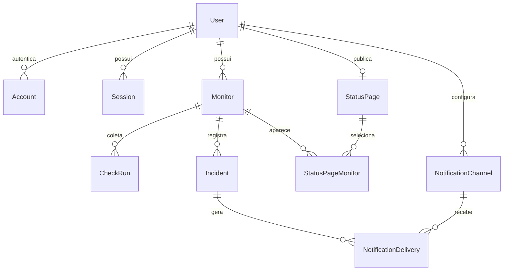

# Modelo de dados

O modelo do MVP está implementado em `prisma/schema.prisma`, com migration inicial e uma segunda migration de restrições PostgreSQL. IDs UUID; horários timestamptz em UTC. Schema validado e migrations aplicadas em banco vazio durante a entrega M0. As integrações de autenticação e monitoramento ainda pertencem às próximas entregas.

## Entidades do MVP

| Entidade | Campos principais | Regras |
| --- | --- | --- |
| User | id, name, email?, image?, createdAt | Identidade do proprietário; email não obrigatório para GitHub |
| Account | campos exigidos pelo adapter de autenticação | Único provider/providerAccountId; tokens nunca públicos |
| Session | sessionToken, userId, expires | Conforme estratégia e adapter; validar schema no scaffold |
| Monitor | id, ownerId, name, url, expectedStatus, intervalSeconds, timeoutMs, enabled, status, configRevision, consecutiveFailures, firstFailureAt?, lastCompletedAt?, nextCheckAt, leaseToken?, leaseUntil?, createdAt, updatedAt | URL privada; lease ativa aponta para a execução corrente |
| CheckRun | id, monitorId, scheduledAt, revision, startedAt?, completedAt?, state, leaseToken?, attemptCount, outcome?, httpStatus?, latencyMs?, errorCode? | Estado QUEUED/RUNNING/COMPLETED; outcome SUCCESS/FAILURE/COLLECTOR_ERROR/BLOCKED |
| Incident | id, monitorId, startedAt, confirmedAt, endedAt?, endReason?, failureCode, createdAt | endReason RECOVERED/CONFIG_CHANGED; endedAt nulo indica aberto |
| StatusPage | id, ownerId, slug, title, description?, published, createdAt, updatedAt | Um owner por página; slug globalmente único, minúsculo e validado |
| StatusPageMonitor | statusPageId, monitorId, publicName, position | Relação explícita, ambos do mesmo owner |
| WorkerHeartbeat | workerId, lastSeenAt, version | Diagnóstico de coleta, não disponibilidade monitorada |
| MaintenanceLease | name, token, expiresAt | Exclusão mútua para limpeza diária |

No schema de autenticação, seguir o adapter escolhido; não inventar um modelo incompatível com o provider. Se a estratégia for JWT, Session pode ser dispensada com decisão documentada.

## Restrições e índices

- Monitor: CHECK intervalSeconds IN (60, 300, 900), timeoutMs BETWEEN 2000 AND 15000, expectedStatus BETWEEN 200 AND 599, consecutiveFailures >= 0.
- Monitor: índice ownerId/createdAt e índice parcial nextCheckAt para enabled = true.
- CheckRun: UNIQUE (monitorId, scheduledAt); índice (monitorId, completedAt DESC), índice completedAt para retenção e state/lease para recuperação.
- CheckRun: completedAt e outcome obrigatórios quando state = COMPLETED. latencyMs não negativo se preenchido; erro interno não pode ser SUCCESS/FAILURE.
- Incident: índice (monitorId, startedAt DESC); índice único parcial monitorId WHERE endedAt IS NULL. endedAt >= startedAt e endReason obrigatório em incidentes encerrados.
- StatusPage: UNIQUE ownerId e UNIQUE slug.
- StatusPageMonitor: chave composta (statusPageId, monitorId); posição não negativa.
- Todas as FKs de histórico e publicação fazem cascade ao excluir monitor. Exclusão de usuário remove dados próprios conforme fluxo futuro de conta.
- A seleção pública usa FKs compostas com ownerId: o banco rejeita associações entre donos diferentes. A aplicação também deverá validar propriedade antes de publicar; o comportamento do banco já possui teste de integração.

## Transações críticas

**Criação:** verificar limite de monitores sob lock do proprietário e inserir. Contar sem lock permitiria ultrapassar o limite em requisições simultâneas.

**Reserva:** selecionar monitores vencidos sob lock, criar/reutilizar CheckRun e atribuir token/vencimento atomicamente. Atualizar lease no Monitor e no CheckRun na mesma transação.

**Conclusão:** adquirir Monitor antes do CheckRun, conferir token, vencimento, enabled e revision. Persistir resultado e transição de incidente; limpar lease e reagendar. Resultado antigo pode ser descartado, nunca aplicado ao estado atual.

**Edição/pausa:** mesma ordem de locks; invalidar reserva e atualizar configuração/revisão. Mudança de URL encerra incidente com motivo específico e limpa sequência.

**Publicação:** verificar ownership de todos os monitores, substituir seleção e atualizar página numa transação.

## Próxima etapa: alertas

NotificationChannel: id, ownerId, type DISCORD/EMAIL, enabled, destino protegido, createdAt. NotificationDelivery: id, incidentId, channelId, event OPENED/RECOVERED, status PENDING/SENT/FAILED, attempts, nextAttemptAt, sentAt?, sanitizedError?. UNIQUE (incidentId, channelId, event).

O evento é inserido na mesma transação que abre/resolve o incidente. O worker de entregas reserva itens, envia e registra resultado. Não incluir tabelas ou integrações de alertas na primeira migration se não forem utilizadas.
